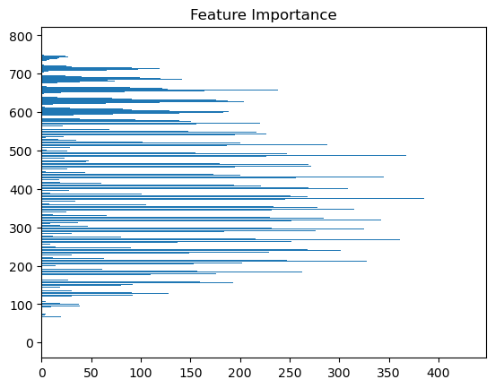

# **Handwritten Digit Recognition with Machine Learning**

## **Table of Contents**
1. [Project Overview](#project-overview)
2. [Project Goals](#project-goals)
3. [Dataset](#dataset)
4. [Methodology](#methodology)
    - [Data Preprocessing](#data-preprocessing)
    - [Model Training](#model-training)
    - [Evaluation](#evaluation)
    - [Deployment](#deployment)
5. [Results](#results)
6. [How to Use](#how-to-use)
    - [Installation](#installation)
    - [Run the FastAPI Backend](#run-the-fastapi-backend)
    - [Run the Streamlit App](#run-the-streamlit-app)
    - [Upload an Image](#upload-an-image)
7. [Future Work](#future-work)
8. [Contributors](#contributors)

---

## **Project Overview**
This project demonstrates a machine learning pipeline for recognizing handwritten digits (0-9) using the MNIST dataset. The solution is designed to preprocess images, train a robust model, and deploy it as an interactive API and user interface.

---

## **Project Goals**
- Implement an end-to-end machine learning pipeline for digit recognition.
- Train a robust classifier using LightGBM and evaluate its performance.
- Deploy the model using a FastAPI backend and provide an interactive UI with Streamlit.
- Provide reusable code and documentation for further exploration and experimentation.

---

## **Dataset**
The project uses the [MNIST dataset](http://yann.lecun.com/exdb/mnist/) containing 60,000 training images and 10,000 test images of handwritten digits. Each image is a grayscale 28x28 pixel representation of a digit.

- **Training Data**: 42,000 samples
- **Validation Data**: 8,400 samples
- **Test Data**: 10,000 samples
- **Format**: Each image is represented as a flattened array of 784 pixel values (28x28), with corresponding labels (digits 0-9).

---

## **Methodology**

### **1. Data Preprocessing**
- **Normalization**: Pixel values were scaled to the range [0, 1].
- **Flattening**: Each 28x28 image was flattened into a 1D array of 784 features.
- **Validation Split**: 80-20 split of training data into training and validation sets.

### **2. Model Training**
- **Model**: LightGBM was chosen for its speed and performance with tabular data.
- **Hyperparameter Optimization**: RandomizedSearchCV was used to tune parameters like:
  - `max_depth`
  - `num_leaves`
  - `learning_rate`
  - `n_estimators`
- **Evaluation Metrics**: Accuracy, precision, recall, and F1-score were used.

### **3. Evaluation**
The model was evaluated using:
- **Learning Curves**: To analyze training and validation performance.
- **Confusion Matrix**: To identify class-specific performance.
- **Feature Importance**: To understand which pixel regions were most critical for predictions.

### **4. Deployment**
- **API**: A FastAPI backend was implemented for serving predictions.
- **UI**: Streamlit was used to create a user-friendly interface for image upload and model prediction.

---

## **Results**
- **Training Accuracy**: 99.6%
- **Validation Accuracy**: 98.7%
- **Test Accuracy**: 98.4%

### **Confusion Matrix**:


### **Feature Importances**:


---

## **How to Use**

### **1. Installation**
Clone the repository and create the Conda environment:
```bash
git clone https://github.com/your-username/handwritten-dataset.git
cd handwritten-dataset
conda env create -f environment.yml
conda activate handwritten-digit-recognition
```

### **2. Run the FastAPI Backend**
Start the backend server for model predictions:
```bash
uvicorn main:app --reload
```

### **3. Run the Streamlit App**
Launch the Streamlit app for an interactive UI:
```bash
streamlit run app.py
```

### **4. Upload an Image**
- Upload an image of a handwritten digit (e.g., number_5.png) through the Streamlit app.
- View the predicted digit along with its confidence score.

## **Future Work**
- Expand the dataset by incorporating real-world handwritten digits.
- Use data augmentation techniques to improve robustness.
- Deploy the app on the cloud (e.g., AWS, Azure, Streamlit Cloud) for public access.
- Experiment with deep learning models (e.g., CNNs) for improved accuracy.
